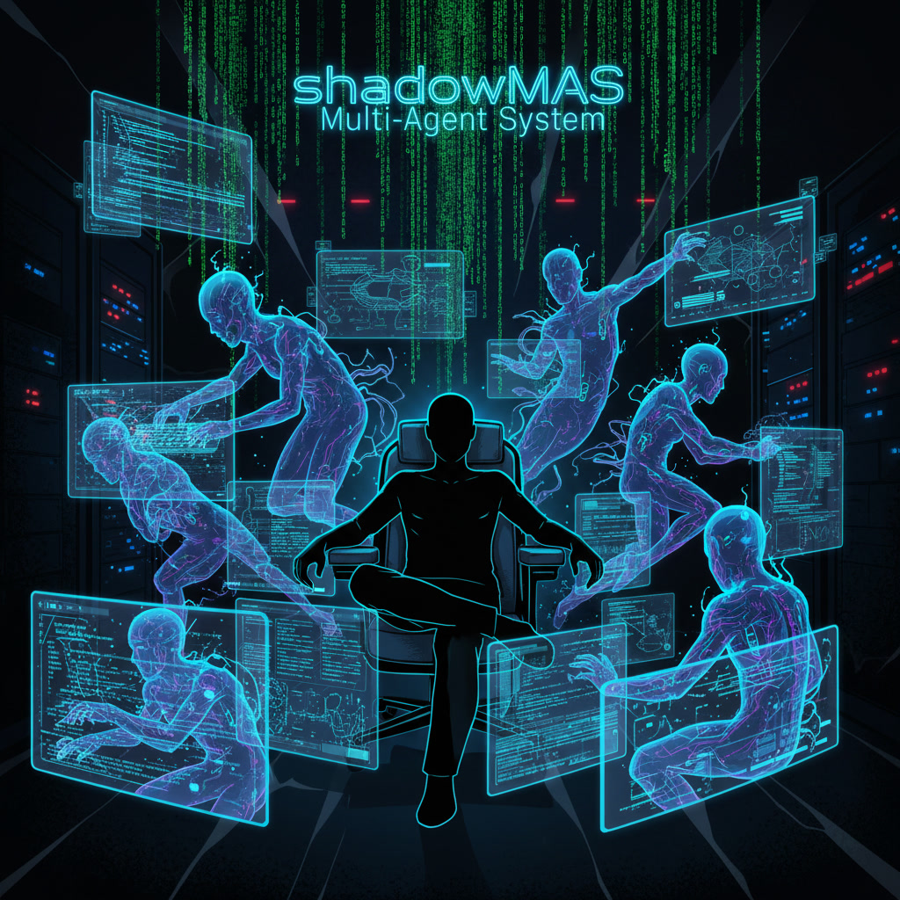

# shadowMAS

shadowMAS is a governance-oriented, memory-aware, human-AI collaboration system.

It is not the product application itself.  
It is a separate governance system for multi-agent and multi-session work.

## What problem shadowMAS solves

shadowMAS exists to reduce five failure modes that become common once AI work grows beyond a single chat:

- **authority confusion** — who may decide, who may execute, and who may promote results
- **truth confusion** — execution output, cache, and drafts being mistaken for canonical truth
- **giant prompt collapse** — reusable rules, governance, project truth, and runtime-specific constraints being flattened into one blob
- **intake chaos** — blind full-repo traversal instead of controlled entry and compiled intake
- **mergeback contamination** — governance artifacts polluting product repos or overriding project-domain truth

## What shadowMAS is not

shadowMAS is not:
- the product application itself
- a giant prompt system
- a blind repo traversal bot
- a direct replacement for project-specific canonical truth
- a UI-first platform
- a DB-first platform
- just another general-purpose agent framework

## Why hard separation matters

shadowMAS must remain hard-separated from product repos.

A product repo should still be able to:
- develop
- implement
- test
- deploy
- operate

even if shadowMAS is unavailable.

Preferred model:
- shadowMAS lives in its own root/repo
- product repos consume selected outputs only

Typical outputs:
- entry/index files
- truth-priority files
- change-impact maps
- handoff packets
- review outputs
- write-back suggestions
- controlled scripts/hooks

## Why machine-first artifacts matter

shadowMAS uses human-facing docs and machine-first artifacts for different jobs.

Human-facing docs are for:
- onboarding
- navigation
- explanation
- design rationale
- review support

Machine-first artifacts are for:
- packets
- registries
- routing
- validation
- automation surfaces

Machine-first artifacts should converge toward:
- minimal format
- parseability
- low ambiguity
- explicit structure
- stable contract boundaries

## v0 repo purpose

This repo is the minimum landing zone for shadowMAS v0.

Current direction:
- docs-as-code
- machine-readable registry
- CLI-first
- no UI in v0
- no DB-first design
- hard-separated from product repos

## Top-level directory guide

### `00_entry/`
Entry and navigation files for agents and humans.  
Use this layer to avoid blind repo traversal.

### `01_truth/`
Formal truth drafts and promoted governance documents.

### `02_packets/`
Packet schemas, packet field definitions, and shared machine-stable exchange structures.

### `03_memory/`
Minimum memory-plane structure:
- session_log
- working_memory
- shared_memory
- registry

### `04_runtime/`
Runtime state folders for inbox, packetized artifacts, indexing, review, approval, rejection, and writeback.

### `05_scripts/`
CLI-oriented scripts grouped by function:
- ingest
- packetize
- validate
- embed
- review
- writeback

### `06_human_docs/`
Human-facing documents.
- `zh-TW/` is the primary human explanation and navigation area
- `en/` contains the English operator onboarding entry

### `07_working/`
Working integration area for handoffs, merged drafts, temporary working files, and archive state.

## Reading policy

Do not treat this README as the only truth source.  
It is an entry file.

Primary formal truth lives in:
- `01_truth/`

Primary human-facing navigation lives in:
- `06_human_docs/zh-TW/`

Suggested first reading path:
1. `01_truth/SHADOWMAS-CURRENT-TRUTH.v0.en.md`
2. `01_truth/SHADOWMAS-PROMPT-LAYERING-CONTRACT.v0.en.md`
3. `01_truth/SHADOWMAS-GOVERNANCE-MATRIX.v0.en.md`
4. `06_human_docs/zh-TW/SHADOWMAS-SINGLE-SOURCE.v0.zh-TW.md`

## v0 design bias
- rules-first
- text-first
- local-first
- inspectable
- schema-first
- minimal dependencies
- explicit review gates
- bounded write-back

<!-- SHADOWMAS_PRINCIPLES_PATCH:BEGIN -->
## Core governance additions
- capability routing: do not route by model name alone; route by task shape and data shape
- machine-first normalization: machine-first files must converge toward minimal, parseable, low-ambiguity structure
- compiled intake: zero-memory intake should first be composed from existing canonical files; if a compact intake artifact is added later, it should be treated as a compiled artifact, not a new handwritten truth source
<!-- SHADOWMAS_PRINCIPLES_PATCH:END -->
