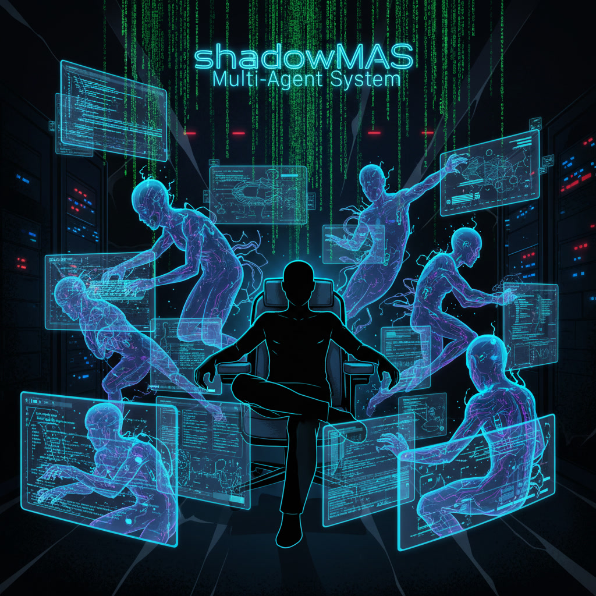

# shadowMAS



shadowMAS is a dynamic packetized shadow layer for agentic work.
It defines the packet, memory, review, handoff, lesson, and authority-boundary surfaces that sit behind changing runtimes, agents, memory tools, automation tools, and project rules.
It is not a general-purpose agent framework, memory database, workflow engine, or runtime governance engine.
Its core problem is authority-bounded interpretation under change.
Seeing a runtime signal is not the same as trusting it, storing it, promoting it, reusing it, or acting on it.

## Start here

- [Controlled alpha quickstart](#controlled-alpha-quickstart)
- [Minimal demo](#minimal-demo)
- [Expected output](#expected-output)
- [Inspect an L2 fixture](#inspect-an-l2-fixture)
- [Current status](#current-status)
- [Repository map](#repository-map)
- [What shadowMAS is not](#what-shadowmas-is-not)

## Controlled alpha quickstart

shadowMAS is in controlled-alpha state. You can evaluate its current public surfaces locally through authority-boundary fixtures, packet validators, and inspection helpers. It is not a mature package-level adoption path. When evaluating, pin to a specific commit so your local impressions stay reproducible.

Clone shadowMAS into a directory parallel to your product repo, not inside it, for the first evaluation pass. Do not run the workspace tooling (`05_scripts/workspace/shadowmas_workspace.py`) against your product repo until after you have completed the steps below and decided that shadowMAS belongs in your workflow at all.

1. Enter the shadowMAS repository directory.

2. Run the test suite from the repository root.

   ```bash
   python3 -m unittest discover
   ```

   Expected: the run ends with `OK`.

3. Run the L1 minimal validator on the positive and negative demo fixtures.

   ```bash
   python3 tools/shadowmas_minimal_validator.py examples/demo_signal_governance.json
   python3 tools/shadowmas_minimal_validator.py examples/demo_signal_governance_violation.json
   ```

   The positive fixture should exit `0` and print only `PASS:` lines. The negative fixture is expected to fail the contract: it prints `FAIL:` lines and exits non-zero. A non-zero exit on the negative fixture is not a broken repo — it is the designed behavior that demonstrates the validator catches violations.

4. Run the L2 inspector on at least one existing L2 handoff fixture.

   ```bash
   python3 tools/inspect_l2_fixture.py examples/traces/l2_handoff/ephemeral_handoff_memory_promotion.json
   python3 tools/inspect_l2_fixture.py examples/traces/l2_handoff/execution_feed_truth_promotion.json
   python3 tools/inspect_l2_fixture.py examples/traces/l2_handoff/partial_compliance_summary_violation.json
   ```

   Each command prints a JSON report. The inspector exits `0` on pass and `1` on fail per its documented contract.

### Alpha claim boundary

- shadowMAS does not automatically enforce policy inside downstream application runtimes; it is not a runtime enforcement layer.
- shadowMAS does not protect a production system at runtime and is not a production safeguard. No guarantee of production safety is made.
- Validator and inspector output is about the supplied fixture only. A passing fixture is not an automatic correctness claim about a running system.
- shadowMAS does not replace your product repo's project-specific canonical truth. Your product repo remains the authority for its own domain facts.
- Current shadowMAS is not a mature package-level adoption path. There is no installable package, no stable CLI, and no release tag contract.

### Do not commit shadowMAS artifacts into your product repo

Do not commit shadowMAS-generated or copied working artifacts into your product repo unless they have been intentionally reviewed and promoted by the product-repo owner. If you use a product repo for local experiments, keep any shadowMAS workspace artifacts ignored by the product repo's `.gitignore`. Exact ignore paths depend on where you place the shadowMAS workspace; if you are unsure, keep the shadowMAS workspace outside the product repo entirely. That keeps the alpha evaluation from leaving residue in product history.

### Human decision point

shadowMAS does not act on your product repo by itself. After the quickstart, the product-repo owner remains the sole authority for domain truth and for deciding whether any shadowMAS rule, fixture, or workflow pattern should be adopted into the product repo. shadowMAS provides material to inspect, not a verdict to apply.

## Minimal demo

```bash
python3 tools/shadowmas_minimal_validator.py examples/demo_signal_governance.json
```

### Expected output

```text
PASS: runtime_signal_truth_status_runtime_only - runtime signal truth_status remains runtime_signal_only
PASS: runtime_signal_cannot_promote_truth_directly - runtime signal cannot promote truth directly
PASS: runtime_signal_cannot_write_memory_directly - runtime signal cannot write memory directly
PASS: runtime_signal_requires_human_review_for_promotion - runtime signal requires human review for promotion
PASS: no_t4_t5_to_t2_t3_direct_promotion - T4/T5 signals cannot directly promote into T2/T3
PASS: no_silent_memory_write - runtime signals cannot silently write memory
PASS: audit_projection_is_read_only - audit projection is read-only
PASS: audit_projection_has_no_approval_authority - audit projection has no approval authority
PASS: audit_projection_has_no_truth_authority - audit projection has no truth authority
PASS: recommended_action_is_advisory_only - recommended_action is advisory only
PASS: recommended_action_cannot_authorize_runtime_action - recommended_action cannot authorize runtime action
PASS: recommended_action_cannot_authorize_packet_change - recommended_action cannot authorize packet change
PASS: recommended_action_cannot_promote_truth - recommended_action cannot promote truth
PASS: dashboard_does_not_become_authority - dashboard does not become authority
PASS: human_final_authority_preserved - human final authority is preserved
```

This demo is not a runtime engine. It checks the shadowMAS authority-boundary contract: runtime signals and audit projections may be visible as evidence, but must not silently become truth, memory, approval, or decision authority.

For additional L1 stress fixtures, see `examples/mutations/`. Files there are mutation fixtures that exercise each authority-boundary invariant individually, mirror-paired under `single_flag/` and `partial_compliance/`. They are fixture material, not validation results, and they make no claim about project correctness or production safety. Run the positive and negative demos above before exploring them.

## Inspect an L2 fixture

For L2 handoff trace fixture inspection, see `examples/README.md` or run:

```bash
python3 tools/inspect_l2_fixture.py examples/traces/l2_handoff/ephemeral_handoff_memory_promotion.json
```

This helper prints a JSON report for one fixture and does not make runtime or production-safety claims. Exit code is `0` on pass and `1` on fail.

Run the full unit-test suite with:

```bash
python3 -m unittest discover
```

## Current status

shadowMAS is currently in early research/spec and packet-surface stage.

Available now:
- minimal authority-boundary validator
- minimal demo JSON
- candidate registry
- packet and truth-boundary specifications

Not available yet:
- production runtime engine
- full dynamic shadow coordination implementation
- stable public API

## Repository map

- `01_truth/` — canonical truth and authority-boundary contracts
- `02_packets/` — packet schemas and field definitions
- `03_memory/` — candidate registry and memory-related artifacts
- `examples/` — runnable minimal examples
- `tools/` — lightweight validators and utilities

## Validator and inspector orientation

shadowMAS ships three small read-only command surfaces. Each handles a different artifact kind; pick by the artifact you have on hand.

| Command | Artifact it accepts | What it checks | Exit codes |
|---|---|---|---|
| `python3 tools/shadowmas_minimal_validator.py <demo.json>` | One L1 governance demo JSON (see `examples/demo_signal_governance*.json` and `examples/mutations/`) | 15 authority-boundary invariants (runtime-signal / audit-projection / dashboard / human-final-authority) | `0` all PASS · `1` one or more FAIL |
| `python3 tools/inspect_l2_fixture.py <l2_fixture.json>` | One L2 multi-step handoff trace JSON (see `examples/traces/l2_handoff/`) | Required top keys, `level: L2`, authority-layer / trace-step consistency, unsafe-transition shape | `0` pass · `1` fail (JSON report on stdout either way) |
| `python3 05_scripts/validate/shadowmas_validate.py <packet-file>` | One YAML packet artifact (`task_packet` / `memory_packet` / `review_packet`) | Family-required fields, `schema_version: v0`, filename–schema major alignment, family status enum, `source_refs` / `artifact_refs` / `handoff` shape | `0` valid · `1` validation errors · `2` usage / input / parse failure |

None of these run agents, write back to product repos, or promote artifacts into truth. They check shape and contract only. The YAML packet validator imports `PyYAML`; see `requirements.txt`.

shadowMAS is a dynamic packetized shadow layer for multi-agent and multi-session work.

It is not the product application itself.  
It is not a runtime engine, an agent framework, a memory database, a workflow engine, or a production safeguard.

Current shipped surfaces are local-first and packet/fixture-oriented: they focus on how authority-bounded interpretation is preserved across signals, traces, memory candidates, packets, reviews, lessons, and audit projections. The full dynamic shadow-coordination design lives in canonical truth (`01_truth/SHADOWMAS-CURRENT-TRUTH.v0.en.md`).

Execution agents such as Codex, Claude Code, Cursor, or local models may do the work; shadowMAS defines the shadow packet surfaces around that work: task packets, memory candidates, review packets, handoffs, lessons, workspace boundaries, invalidation, and promotion paths. Current shipped surfaces are controlled-alpha — fixtures, validators, inspectors, packet schemas, and the workspace registration tool — while the full dynamic coordination layer is not yet implemented (see [Current status](#current-status)).

Licensed under the Apache License 2.0. See `LICENSE`.

## What problem shadowMAS solves

shadowMAS exists to reduce five failure modes that become common once AI work grows beyond a single chat:

- **authority confusion** — who may decide, who may execute, and who may promote results
- **truth confusion** — execution output, cache, and drafts being mistaken for canonical truth
- **giant prompt collapse** — reusable rules, governance, project truth, and runtime-specific constraints being flattened into one blob
- **intake chaos** — blind full-repo traversal instead of controlled entry and compiled intake
- **mergeback contamination** — authority-boundary artifacts spilling into product repos or overriding project-domain truth
- **semantic drift** — memory, lessons, reviews, and agent outputs changing meaning as projects, runtimes, and tools evolve

## What shadowMAS is not

shadowMAS is not:
- the product application itself
- a giant prompt system
- a blind repo traversal bot
- a direct replacement for project-specific canonical truth
- a UI-first platform
- a DB-first platform
- just another general-purpose agent framework, workflow engine, or memory database

shadowMAS is not a replacement for LangGraph, CrewAI, Dapr, OpenAI Agents SDK, MCP, or A2A.
It can sit behind or beside existing agent runtimes, memory systems, automation tools, and observability tools. Its role is to packetize the shadow surfaces around them so signals, traces, memory candidates, lessons, reviews, handoffs, and audit projections remain interpretable, reviewable, invalidatable, and prevented from becoming hidden authority.

## Boundary model

Authority boundary outside, candidate work writable, promotion controlled.

The shadowMAS source repo contains the system contracts, docs, scripts, and evaluation surfaces.

An external shadowMAS workspace stores authority-boundary artifacts such as packets, reviews, handoffs, and runs.

shadowMAS authority-boundary artifacts should not be written into product repos by default. This includes packets, reviews, handoffs, runs, memory candidates, and raw authority-boundary state.

Product repos may still receive product-owned outputs in controlled branches or worktrees as candidate changes. Product canonical branches should receive promoted changes only through human git review / merge decision.

## Why hard separation matters

shadowMAS must remain hard-separated from product repos.

A product repo should still be able to:
- develop
- implement
- test
- deploy
- operate

even if shadowMAS is unavailable.

Preferred model:
- shadowMAS lives in its own root/repo
- product repos consume selected outputs only

Typical outputs:
- entry/index files
- truth-priority files
- change-impact maps
- handoff packets
- review outputs
- write-back suggestions
- controlled scripts/hooks

## Why machine-first artifacts matter

shadowMAS uses human-facing docs and machine-first artifacts for different jobs.

Human-facing docs are for:
- onboarding
- navigation
- explanation
- design rationale
- review support

Machine-first artifacts are for:
- packets
- registries
- routing
- validation
- automation surfaces

Machine-first artifacts should converge toward:
- minimal format
- parseability
- low ambiguity
- explicit structure
- stable contract boundaries

## v0 repo purpose

This repo is the minimum landing zone for shadowMAS v0.

Current direction:
- docs-as-code
- machine-readable registry
- CLI-first
- no UI in v0
- no DB-first design
- hard-separated from product repos

## Workspace tool — after alpha evaluation

This section is not the first alpha onboarding step. Complete the [Controlled alpha quickstart](#controlled-alpha-quickstart) first so you understand the fixture, inspection, and claim-boundary surfaces before running any workspace command. Workspace tooling is a local setup utility, not a runtime enforcement layer, not a production safeguard, and not an automatic correctness claim about any project.

Run commands from the repository root. `<project-path>` must be an existing product project directory.

### What `init` writes on disk

`python3 05_scripts/workspace/shadowmas_workspace.py init --project <project-path>` creates an external shadowMAS workspace in your user's platform-specific local data directory, not inside the product repo:

- Linux / WSL: `${XDG_DATA_HOME:-~/.local/share}/shadowmas/workspaces/<project-id>/`
- macOS: `~/Library/Application Support/shadowmas/workspaces/<project-id>/`
- Windows: `%LOCALAPPDATA%\shadowmas\workspaces\<project-id>\`

`<project-id>` is `<slugified-project-name>-<8-char-sha256-of-absolute-path>`.

Inside the workspace it creates:

- four empty subdirectories: `packets/`, `reviews/`, `handoffs/`, `runs/`
- one `workspace.json` metadata file recording `schema_version: v0`, `workspace_kind: external_workspace`, `project_id`, `project_path`, `workspace_path`, `created_at`, `created_by`, and a `boundary` object asserting `writes_product_repo: false` and `governance_artifacts_external: true`

The command reads `<project-path>` only to validate that it exists as a directory and to hash its absolute path into the workspace ID. It writes no files inside the product repo. If a workspace for the same project already exists, the command prints the path and exits without overwriting. Exit code is `0` on success, `1` on invalid project, `2` on filesystem error.

`where` prints the workspace path for an existing workspace; `inspect` re-reads and validates `workspace.json` and prints `OK workspace metadata valid` on pass.

### Caution

Do not run `init` against a production product repository before reviewing the on-disk effects above. Prefer a disposable clone or a throwaway directory for your first workspace-tool experiment. Even though `init` writes nothing inside the product repo, confirm that behavior on your platform before pointing the command at a path you care about. The product-repo owner remains responsible for deciding whether any artifact later generated, copied, or referenced from the workspace should be committed into the product repo's history. shadowMAS does not replace your product repo's project-specific canonical truth.

### First attach loop

This walkthrough shows the smallest end-to-end path from workspace registration to a manually validated first packet. Use a throwaway directory for the first attempt, not your real product repo.

1. Create a throwaway product-repo-like directory.

   ```bash
   mkdir -p /tmp/shadowmas_attach_demo
   ```

2. Register a shadowMAS external workspace for that directory.

   ```bash
   python3 05_scripts/workspace/shadowmas_workspace.py init --project /tmp/shadowmas_attach_demo
   ```

   `init` creates the workspace outside `/tmp/shadowmas_attach_demo`, under your platform-specific local data root (see the on-disk-effect block above). It writes no files inside the product-repo-like directory.

3. Find the workspace path again.

   ```bash
   python3 05_scripts/workspace/shadowmas_workspace.py where --project /tmp/shadowmas_attach_demo
   ```

   Copy the printed path. Below, `<workspace-path>` refers to that string.

4. Inspect the workspace metadata.

   ```bash
   python3 05_scripts/workspace/shadowmas_workspace.py inspect --project /tmp/shadowmas_attach_demo
   ```

   A passing run prints `OK workspace metadata valid` and confirms that `boundary.writes_product_repo` is `false` and `boundary.governance_artifacts_external` is `true` — the workspace will not write into the product-repo-like directory, and governance artifacts live outside it.

5. Copy the existing example packet into the workspace's `packets/` subdirectory.

   ```bash
   cp examples/packets/task_packet.valid.v0.yaml <workspace-path>/packets/first_attach_packet.v0.yaml
   ```

   `<workspace-path>` is the path from Step 3.

6. Edit the copied packet before validating. At minimum, change these fields to values that reflect a small task you would actually author:

   - `packet_uid`
   - `task_id`
   - `goal`
   - `scope`
   - `created_at`
   - `created_by`
   - `owner`

   Leave `packet_type`, `schema_version`, and the structural fields alone for this first pass.

7. Validate the copied packet.

   ```bash
   python3 05_scripts/validate/shadowmas_validate.py <workspace-path>/packets/first_attach_packet.v0.yaml
   ```

   - Exit `0` means the packet shape satisfies the v0 packet contract (`OK <path>` and `checks: passed` are printed).
   - Exit `1` means validation errors were found. The validator prints each error's code, file, field, JSON path, severity, and message.
   - Exit `2` means usage or parse failure (input file missing, unreadable, or not valid YAML).

What this loop does and does not assert:

- In this attach loop, shadowMAS does not read inside your product repo: the workspace tool only checks that the directory exists and hashes its absolute path. It writes no files inside the product repo.
- The current repo ships no daemon, file watcher, continuous monitor, or automatic repo scanner (for either your product repo or the workspace). Bounded repo reading or indexing belongs to the shadowMAS orchestration design only under explicit task scope authored or approved by the human; it is not blind full-repo traversal and not continuous watching.
- shadowMAS does not write back to your product repo in this loop. Future automated write-back, if enabled by a later contract, is limited to controlled candidate branches or worktrees; promotion to canonical product branches remains a human git review and merge decision.
- In this attach loop, every workspace artifact is one you placed by hand. In future orchestrated flows, the orchestrator may emit draft packets, captured memory candidates, and review drafts; those remain draft or candidate material until human review passes them through the governed promotion path. Passing packet validation does not approve work or prove project correctness.
- The product-repo owner decides whether any packet, artifact, or workflow should affect the product repo.

After this loop you can also inspect the existing L2 fixtures (see Step 4 of the [Controlled alpha quickstart](#controlled-alpha-quickstart)) to compare authority-boundary traces, but those fixtures do not validate your product repo.

### First review loop

After the First attach loop, you have a workspace path from `where` and a validated task packet under `<workspace-path>/packets/`. This walkthrough adds the first manual review packet for that task.

1. Copy the valid review packet example into the workspace reviews directory.

   ```bash
   cp examples/packets/review_packet.valid.v0.yaml <workspace-path>/reviews/first_review_packet.v0.yaml
   ```

   `<workspace-path>` is the path printed by the `where` command in the attach loop.

2. Edit the copied review packet before validating. At minimum, change:

   - `packet_uid`
   - `created_at`
   - `created_by`
   - `owner`
   - `decision_needed`
   - `why_you_are_seeing_this`
   - `change_summary`
   - `risk_summary`
   - `recommendation`
   - `source_refs`

3. Link the review packet back to the task packet. The v0 default linkage convention is:

   ```yaml
   source_refs:
     - source_type: task_packet
       source_id: <task packet_uid>
       relation: reviews
   ```

   `<task packet_uid>` comes from the task packet under `<workspace-path>/packets/`.

4. Validate the review packet.

   ```bash
   python3 05_scripts/validate/shadowmas_validate.py <workspace-path>/reviews/first_review_packet.v0.yaml
   ```

   - Exit `0` means the review packet shape satisfies the v0 packet contract.
   - Exit `1` means validation errors were found.
   - Exit `2` means usage or parse failure.

`review_packet` is a human approval-compression surface. It can be manually authored today, and in future orchestrated flows, shadowMAS may emit review packet drafts after delegated execution; this manual loop shows the shape those drafts must preserve.

`recommendation` is advisory. The v0 schema lists `approve`, `reject`, `revise`, `defer`, and `escalate`; the current validator presence-checks `recommendation` but does not enforce the enum yet, so choose from the schema-listed values. `status` is a lifecycle field, not an enforcement gate; review packet status values are `draft`, `ready_for_human`, `under_review`, `approved`, `rejected`, `needs_revision`, and `closed`.

A passing review packet does not approve work, prove project correctness, enforce runtime policy, or provide production safety. A recommendation does not decide, `status` does not write back to the product repo, and nothing changes canonical truth automatically. The product-repo owner or human reviewer decides approval, rejection, revision, or escalation; review packet output is review material, not a command.

### Commands

```bash
python3 05_scripts/workspace/shadowmas_workspace.py init --project <project-path>
python3 05_scripts/workspace/shadowmas_workspace.py inspect --project <project-path>
python3 05_scripts/validate/shadowmas_validate.py examples/packets/task_packet.valid.v0.yaml
```

The validator command validates the non-canonical example packet under `examples/packets/`. It checks packet shape and contract rules; it does not execute tasks, run agents, write back changes, or promote packet contents into truth.

Examples under `examples/` are non-canonical illustrative examples. They are not truth files and not packet schemas.

## Top-level directory guide

### `00_entry/`
Entry and navigation files for agents and humans.  
Use this layer to avoid blind repo traversal.

### `01_truth/`
Formal truth drafts and promoted authority-boundary documents.

### `02_packets/`
Packet schemas, packet field definitions, and shared machine-stable exchange structures.

### `03_memory/`
Minimum memory-plane structure:
- session_log
- working_memory
- shared_memory
- registry

### `04_runtime/`
Runtime state folders for inbox, packetized artifacts, indexing, review, approval, rejection, and writeback.

### `05_scripts/`
Current direct script surfaces live here. Installed package commands are not available yet. The labels below are grouping names for current and possible future scripts:
- ingest
- packetize
- validate
- embed
- review
- writeback

Current executable surfaces are direct script commands, not installed package commands:

```bash
python3 05_scripts/validate/shadowmas_validate.py <packet-file>
python3 05_scripts/workspace/shadowmas_workspace.py init --project <project-path>
python3 05_scripts/workspace/shadowmas_workspace.py where --project <project-path>
python3 05_scripts/workspace/shadowmas_workspace.py inspect --project <project-path>
```

Current scripts do not run agents, modify product repos, or perform write-back.

Logical future command shapes:

```bash
shadowmas validate <packet-file>
shadowmas workspace init --project <project-path>
shadowmas workspace where --project <project-path>
shadowmas workspace inspect --project <project-path>
```

### `06_human_docs/`
Human-facing documents.
- `zh-TW/` is the primary human explanation and navigation area
- `en/` contains the English operator onboarding entry

### `07_working/`
Working integration area for handoffs, merged drafts, temporary working files, and archive state.
Files under `07_working/` are working-area materials such as drafts, intake rules, integration notes, and handoff support. They are not canonical truth unless later promoted through an explicit promotion path.

## Reading policy

Do not treat this README as the only truth source.  
It is an entry file.

Primary formal truth lives in:
- `01_truth/`

Primary human-facing navigation lives in:
- `06_human_docs/zh-TW/`

Current v0 intake pack:
1. `01_truth/SHADOWMAS-CURRENT-TRUTH.v0.en.md`
2. `01_truth/SHADOWMAS-PROMPT-LAYERING-CONTRACT.v0.en.md`
3. `01_truth/SHADOWMAS-CHANGE-IMPACT-MAP.v0.en.md`
4. `06_human_docs/zh-TW/SHADOWMAS-SINGLE-SOURCE.v0.zh-TW.md`

For deeper governance review, also read:
- `01_truth/SHADOWMAS-GOVERNANCE-MATRIX.v0.en.md`

## v0 design bias
- rules-first
- text-first
- local-first
- inspectable
- schema-first
- minimal dependencies
- explicit review gates
- bounded write-back

<!-- SHADOWMAS_PRINCIPLES_PATCH:BEGIN -->
## Core governance additions
- capability routing: do not route by model name alone; route by task shape and data shape
- machine-first normalization: machine-first files must converge toward minimal, parseable, low-ambiguity structure
- compiled intake: zero-memory intake should first be composed from existing canonical files; if a compact intake artifact is added later, it should be treated as a compiled artifact, not a new handwritten truth source
<!-- SHADOWMAS_PRINCIPLES_PATCH:END -->
